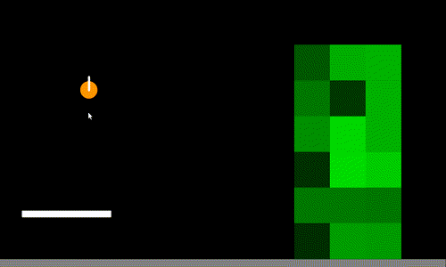

  

## Features
1. **Propeller System:**
   - Set up a static propeller that rotates based on keyboard input.
   
2. **Bird Mechanics:**
   - Press 'b' to spawn birds at the mouse cursor, allowing them to interact with the propeller.
   
3. **Tower of Boxes:**
   - Create a tower with 80x80 pixel boxes in different shades of green.
   
4. **Slingshot Mechanism:**
   - Add a slingshot that allows birds to be launched toward the tower.

## Development Steps
- **Propeller:** Initialize and animate the propeller with adjustable speed.
- **Birds:** Create birds and handle their collisions with the propeller and tower.
- **Tower:** Generate a tower of destructible boxes.
- **Slingshot:** Design a slingshot to launch birds.
  
## How To Scale
- Add a countdown timer, style customizations, or new physics objects.
